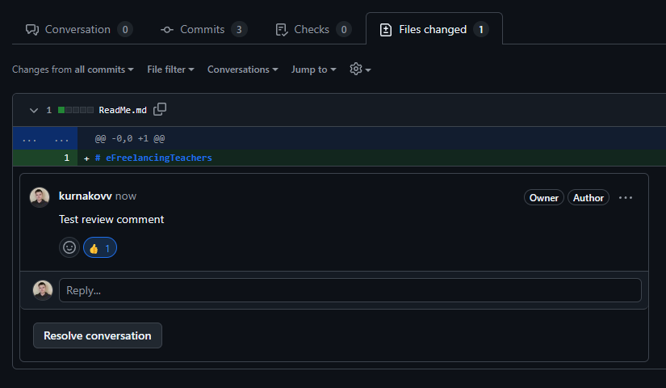

# Contributing

### External contributor
* Open [issues](https://github.com/kurnakovv/eFreelancingTeachers/issues)
* Find or create an issue using [templates](https://github.com/kurnakovv/eFreelancingTeachers/issues/new/choose)
* Fork and clone repository
* Read about how to [start](https://github.com/kurnakovv/eFreelancingTeachers/wiki/Start) an application
* Create branch based on main branch, with the following format: `ft-ISSUE_NUMBER`, for example `ft-19`
* Read about [code rules](https://github.com/kurnakovv/eFreelancingTeachers/wiki/Rules)
* Make your changes
* Start [linters](https://github.com/kurnakovv/eFreelancingTeachers/wiki/Linters)
* Commit changes with issue number, with the following format: `#ISSUE_NUMBER YOUR_MESSAGE`,  for example `#42 Add profile registration`. Commit message must contains present tense ([reason](https://stackoverflow.com/a/3580764/22817151)) and have a meaningful form ([click1](https://gist.github.com/robertpainsi/b632364184e70900af4ab688decf6f53), [click2](https://www.freecodecamp.org/news/how-to-write-better-git-commit-messages/))
* Create PR
* If there are any comments in the review, correct everything in your code and click like (👍) if the comment is resolved 
* Done :)

Note: If you want to become a team member, then write to us by email, we will consider your application `ToDo: add email`

### Team member
* Open [issues](https://github.com/kurnakovv/eFreelancingTeachers/issues)
* Select a task where you are assigned, if you don't have any tasks, then find or create an issue using [templates](https://github.com/kurnakovv/eFreelancingTeachers/issues/new/choose)
* Open kanban project ([click](https://github.com/users/kurnakovv/projects/12))
* Move task from `Backlog` --> `ToDo`
* Clone repository
* Read about how to [start](https://github.com/kurnakovv/eFreelancingTeachers/wiki/Start) an application
* Create branch based on main branch, with the following format: `ft-ISSUE_NUMBER`, for example `ft-19`
* Move task from `ToDo` --> `In progress`
* Read about [code rules](https://github.com/kurnakovv/eFreelancingTeachers/wiki/Rules)
* Make your changes
* Start [linters](https://github.com/kurnakovv/eFreelancingTeachers/wiki/Linters)
* Commit changes with issue number, with the following format: `#ISSUE_NUMBER YOUR_MESSAGE`,  for example `#42 Add profile registration`. Commit message must contains present tense ([reason](https://stackoverflow.com/a/3580764/22817151)) and have a meaningful form ([click1](https://gist.github.com/robertpainsi/b632364184e70900af4ab688decf6f53), [click2](https://www.freecodecamp.org/news/how-to-write-better-git-commit-messages/))
* Create PR
* Move task from `In progress` --> `In review` and click `request review`
* If there are any comments in the review, correct everything in your code and click like (👍) if the comment is resolved 
* After reviewer closed all threads and approved the task, move it from `In review` --> `Test`
* If there are any comments from tester, correct everything in your code, create tests and click like (👍) on comment(s)
* After tester approved your changes, move the task `Test` --> `Check`
* If there are any comments from manager, correct everything in your code, click like (👍) on comment(s)
* Say to owner that task is done (he will merge your PR to production soon)
* Done :)

### Reviewer
ToDo

### Owner
ToDo

### Tester
ToDo

### Manager
ToDo
